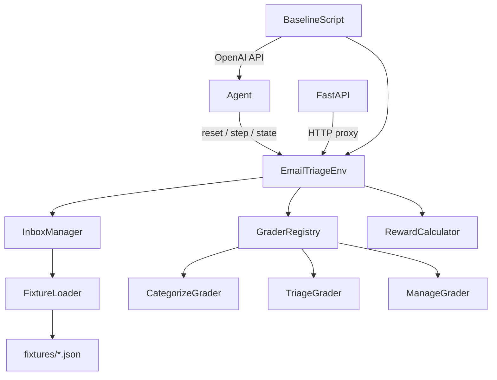

# Design Document: OpenEnv Email Triage

## Overview

OpenEnv Email Triage is a reinforcement-learning benchmark environment that simulates inbox management. An AI agent processes emails one at a time, choosing from six operations (categorize, prioritize, reply, escalate, archive, delete) or skipping. The environment follows the standard OpenEnv interface (`reset` / `step` / `state`) and ships with three tasks of increasing difficulty, a deterministic grader, a baseline inference script, and a Hugging Face Space deployment.

The design prioritizes:
- **Schema correctness** via Pydantic v2 models with strict validation
- **Reproducibility** via static fixture files with SHA-256 checksums
- **Composability** via a clean Python API and a thin FastAPI HTTP layer
- **Observability** via per-step partial reward signals

---

## Architecture



### Layer Responsibilities

- **EmailTriageEnv**: Stateful environment class. Owns episode lifecycle, step counter, action history, and done flag.
- **InboxManager**: Loads and validates fixture data; provides ordered email iteration.
- **GraderRegistry**: Maps `task_id` strings to the appropriate `Grader` implementation.
- **RewardCalculator**: Computes per-step `Reward` objects from an action, the current email, and ground-truth metadata.
- **FastAPI app**: Thin HTTP wrapper — no business logic, only serialization and routing.
- **BaselineScript**: Standalone script; drives the environment via the Python API, calls OpenAI, writes results.

---

## Components and Interfaces

### EmailTriageEnv

```python
class EmailTriageEnv:
    def reset(self, task_id: str) -> Observation: ...
    def step(self, action: Action) -> tuple[Observation, Reward, bool, dict]: ...
    def state(self) -> dict: ...
    def render(self) -> str: ...
    def get_fixture_version(self) -> str: ...
```

Internal state:
- `_task_id: str`
- `_inbox: list[Email]`
- `_step: int`
- `_done: bool`
- `_history: list[tuple[Action, Reward]]`
- `_consecutive_skips: int`

### GraderProtocol

```python
class GraderProtocol(Protocol):
    def score_step(self, email: Email, action: Action, ground_truth: dict) -> Reward: ...
    def score_episode(self, history: list[tuple[Action, Reward]], inbox: list[Email]) -> Reward: ...
```

Three concrete implementations: `CategorizeGrader`, `TriageGrader`, `ManageGrader`.

### FixtureLoader

```python
class FixtureLoader:
    def load(self, task_id: str) -> FixtureData: ...
    def verify_checksum(self, data: dict, path: Path) -> None: ...  # raises ValueError on mismatch
```

`FixtureData` holds the email list, ground-truth annotations, and `fixture_version`.

### FastAPI Routes

| Method | Path      | Body / Params       | Returns                              |
|--------|-----------|---------------------|--------------------------------------|
| POST   | /reset    | `{"task_id": str}`  | `Observation`                        |
| POST   | /step     | `Action`            | `{observation, reward, done, info}`  |
| GET    | /state    | —                   | `dict`                               |
| GET    | /render   | —                   | `{"text": str}`                      |

---

## Data Models

All models use Pydantic v2 with `model_config = ConfigDict(strict=True)`.

```python
from datetime import datetime
from enum import Enum
from typing import Optional
from pydantic import BaseModel, ConfigDict, Field, field_validator

class Operation(str, Enum):
    categorize = "categorize"
    prioritize = "prioritize"
    reply      = "reply"
    escalate   = "escalate"
    archive    = "archive"
    delete     = "delete"
    skip       = "skip"

class Email(BaseModel):
    model_config = ConfigDict(strict=True)
    id:          str
    subject:     str
    sender:      str
    body:        str
    timestamp:   datetime
    thread_id:   str
    labels:      list[str]
    attachments: list[str]

class Action(BaseModel):
    model_config = ConfigDict(strict=True)
    operation:  Operation
    label:      Optional[str]  = None
    priority:   Optional[int]  = Field(None, ge=1, le=3)
    reply_text: Optional[str]  = None

class Observation(BaseModel):
    model_config = ConfigDict(strict=True)
    email:       Email
    inbox_size:  int
    step_number: int
    task_id:     str

class Reward(BaseModel):
    model_config = ConfigDict(strict=True)
    score:          float = Field(ge=0.0, le=1.0)
    partial_scores: dict[str, float]
    rationale:      str
```

### Fixture Schema (JSON)

```json
{
  "fixture_version": "1.0.0",
  "checksum": "<sha256-hex>",
  "task_id": "categorize_easy",
  "emails": [
    {
      "id": "e001",
      "subject": "...",
      "sender": "...",
      "body": "...",
      "timestamp": "2024-01-15T09:00:00Z",
      "thread_id": "t001",
      "labels": [],
      "attachments": []
    }
  ],
  "ground_truth": [
    {
      "email_id": "e001",
      "label": "spam",
      "priority": null,
      "reply_required": false,
      "escalate": false,
      "should_archive": false,
      "should_delete": true
    }
  ]
}
```

### openenv.yaml Schema

```yaml
name: openenv-email-triage
version: "1.0.0"
description: "Inbox management RL environment with three tasks of increasing difficulty."
observation_space: openenv_email_triage.models.Observation
action_space: openenv_email_triage.models.Action
reward_range: [0.0, 1.0]
space_url: "https://huggingface.co/spaces/<org>/openenv-email-triage"
tasks:
  - id: categorize_easy
    difficulty: easy
    description: "Assign a single correct label to each of 10 emails."
  - id: triage_medium
    difficulty: medium
    description: "Assign priority and draft replies for 15 emails with mixed urgency."
  - id: manage_hard
    difficulty: hard
    description: "Apply all six operations across 25 emails to reach a clean inbox state."
```

---

## Correctness Properties

*A property is a characteristic or behavior that should hold true across all valid executions of a system — essentially, a formal statement about what the system should do. Properties serve as the bridge between human-readable specifications and machine-verifiable correctness guarantees.*


### Property 1: Invalid Action raises ValidationError without state mutation

*For any* active episode and any Action constructed with an invalid `operation` string or a `priority` value outside {1, 2, 3}, constructing or submitting the Action SHALL raise a `ValidationError` and the episode state (step_number, history, done) SHALL remain unchanged.

**Validates: Requirements 1.4, 1.5**

---

### Property 2: Categorization scoring correctness

*For any* email in the `categorize_easy` fixture, if the Agent submits a `categorize` action with the ground-truth label the per-email reward score SHALL be 1.0; for any other label (including `skip`) the per-email reward score SHALL be 0.0.

**Validates: Requirements 4.2, 4.3, 4.6**

---

### Property 3: Priority scoring by distance

*For any* email in the `triage_medium` fixture with ground-truth priority `p`, if the Agent submits `prioritize` with value `v`, the priority sub-score SHALL be: 1.0 when `|v - p| == 0`, 0.5 when `|v - p| == 1`, and 0.0 when `|v - p| == 2`.

**Validates: Requirements 5.2, 5.3, 5.4**

---

### Property 4: Correct operation scoring in manage_hard

*For any* email in the `manage_hard` fixture, applying the operation that matches the ground-truth annotation (`escalate`, `archive`, or `delete` when the corresponding flag is True) SHALL yield a sub-score of 1.0 for that dimension; applying `delete` when `should_delete = False` SHALL yield a sub-score of -0.5.

**Validates: Requirements 6.3, 6.4, 6.5, 6.6**

---

### Property 5: Episode termination invariant

*For any* task, after exactly N calls to `step()` (where N equals the inbox size for that task), `done` SHALL be `True`; any subsequent call to `step()` SHALL raise a `RuntimeError` with the message "Episode has ended. Call reset() to start a new episode."

**Validates: Requirements 2.3, 2.6**

---

### Property 6: Step counter monotonicity

*For any* active episode, the `step_number` field in the returned `Observation` after the k-th call to `step()` SHALL equal k (0-indexed: first Observation from `reset()` has `step_number = 0`).

**Validates: Requirements 2.5**

---

### Property 7: State JSON-serializability

*For any* episode state (at any step, including after reset and after done), calling `state()` SHALL return a value that is successfully serializable by `json.dumps()` without error.

**Validates: Requirements 2.4**

---

### Property 8: Reward structural invariant

*For any* call to `step()`, the returned `Reward` SHALL have a non-empty `partial_scores` dict and a `rationale` string that contains the current email's `id`.

**Validates: Requirements 7.2, 7.5**

---

### Property 9: Episode-level score matches Grader output

*For any* completed episode on any task, the `score` field of the final summary `Reward` returned by the last `step()` SHALL equal the value returned by the corresponding Grader's `score_episode()` method on the same history.

**Validates: Requirements 7.3**

---

### Property 10: Consecutive skip penalty

*For any* episode where the Agent submits more than 3 consecutive `skip` actions, each `step()` beyond the 3rd consecutive skip SHALL reduce the reward `score` by 0.05 relative to the base score for that step.

**Validates: Requirements 7.4**

---

### Property 11: Loop detection penalty

*For any* episode in `manage_hard` where the same email `id` is processed more than once, each duplicate processing step SHALL incur a penalty of 0.1 subtracted from that step's reward score.

**Validates: Requirements 6.7**

---

### Property 12: Final score clamping

*For any* completed `manage_hard` episode, the Grader's episode-level score SHALL be in [0.0, 1.0] regardless of accumulated penalties.

**Validates: Requirements 6.8**

---

### Property 13: Grader score formula — categorize_easy

*For any* completed `categorize_easy` episode with `c` correctly labeled emails (out of 10), the episode-level score SHALL equal `c / 10`.

**Validates: Requirements 4.4**

---

### Property 14: Grader score formula — triage_medium

*For any* completed `triage_medium` episode, the episode-level score SHALL equal the arithmetic mean of all per-email scores, where each per-email score is the mean of its priority sub-score and reply sub-score.

**Validates: Requirements 5.7**

---

### Property 15: Grader score formula — manage_hard weighted mean

*For any* completed `manage_hard` episode, the pre-clamp episode score SHALL equal the weighted sum: `0.25 * cat + 0.25 * pri + 0.20 * reply + 0.15 * esc + 0.15 * arch_del`.

**Validates: Requirements 6.2**

---

### Property 16: Deterministic grading

*For any* task and any fixed sequence of Actions, running the same sequence twice (in two separate episodes via `reset()`) SHALL produce identical sequences of `Reward` objects.

**Validates: Requirements 10.3, 4.5**

---

### Property 17: Baseline error resilience

*For any* simulated OpenAI API error on a given step, the baseline script SHALL assign a score of 0.0 for that step and continue processing the remaining emails without raising an unhandled exception.

**Validates: Requirements 8.6**

---

## Error Handling

| Scenario | Component | Behavior |
|---|---|---|
| Invalid `operation` in Action | Pydantic model | `ValidationError` raised at construction time |
| `priority` outside {1,2,3} | Pydantic model | `ValidationError` raised at construction time |
| `step()` called after `done=True` | `EmailTriageEnv.step()` | `RuntimeError("Episode has ended. Call reset() to start a new episode.")` |
| Fixture file missing | `FixtureLoader.load()` | `FileNotFoundError` with path |
| Fixture checksum mismatch | `FixtureLoader.verify_checksum()` | `ValueError("Checksum mismatch for fixture <path>")` |
| Fixture version mismatch | `FixtureLoader.load()` | `logging.warning(...)` — non-fatal |
| `OPENAI_API_KEY` not set | `baseline.py` | `EnvironmentError("OPENAI_API_KEY environment variable is not set")` |
| OpenAI API error during step | `baseline.py` | Log error, assign score 0.0, continue |
| Unknown `task_id` passed to `reset()` | `GraderRegistry` | `ValueError("Unknown task_id: <id>")` |
| `Reward.score` out of [0,1] | Pydantic model | `ValidationError` — grader must clamp before constructing |

---

## Testing Strategy

### Dual Testing Approach

Both unit tests and property-based tests are required. They are complementary:
- Unit tests cover specific examples, integration points, and error conditions.
- Property tests verify universal invariants across randomized inputs.

### Unit Tests

Focus areas:
- Fixture loading: verify checksum validation, version warning, and correct deserialization.
- `openenv.yaml` structure: all required fields present, reward_range correct, all three tasks listed.
- `reset()` returns Observation with `step_number=0` and correct `task_id`.
- `step()` after `done=True` raises `RuntimeError`.
- Baseline script raises `EnvironmentError` when `OPENAI_API_KEY` is absent.
- Baseline writes `baseline_results.json` with all required fields.
- `render()` returns a non-empty string.

### Property-Based Tests

Library: **[Hypothesis](https://hypothesis.readthedocs.io/)** (Python).

Each property test runs a minimum of **100 iterations**.

Each test is tagged with a comment in the format:
`# Feature: openenv-email-triage, Property <N>: <property_text>`

| Property | Test Description | Strategy |
|---|---|---|
| P1 | Invalid Action raises ValidationError | Generate arbitrary strings not in Operation enum; generate ints outside {1,2,3} |
| P2 | Categorization scoring correctness | For each fixture email, generate correct and incorrect labels |
| P3 | Priority scoring by distance | Generate (ground_truth, submitted) priority pairs with known distance |
| P4 | Correct operation scoring in manage_hard | Generate actions matching/not matching ground-truth flags |
| P5 | Episode termination invariant | Run full episodes on all three tasks; check done and RuntimeError |
| P6 | Step counter monotonicity | Run random-length partial episodes; check step_number sequence |
| P7 | State JSON-serializability | Run random episodes; call state() at each step |
| P8 | Reward structural invariant | Run random episodes; inspect every Reward |
| P9 | Episode-level score matches Grader | Run full episodes; compare final Reward to direct Grader call |
| P10 | Consecutive skip penalty | Generate sequences with 4+ consecutive skips |
| P11 | Loop detection penalty | Construct episodes that revisit the same email id |
| P12 | Final score clamping | Generate worst-case penalty-heavy manage_hard episodes |
| P13 | categorize_easy score formula | Generate all 11 possible correct-count values (0..10) |
| P14 | triage_medium score formula | Generate random per-email sub-score combinations |
| P15 | manage_hard weighted mean | Generate random sub-score vectors; verify weighted sum |
| P16 | Deterministic grading | Run same action sequence twice; compare Reward sequences |
| P17 | Baseline error resilience | Mock OpenAI client to raise errors on random steps |

### Test File Layout

```
tests/
  unit/
    test_models.py          # Pydantic model validation
    test_fixture_loader.py  # Checksum, version, deserialization
    test_manifest.py        # openenv.yaml structure
    test_env_lifecycle.py   # reset/step/state/render integration
    test_baseline.py        # Baseline script unit tests
  property/
    test_action_validation.py   # P1
    test_categorize_grader.py   # P2, P13
    test_triage_grader.py       # P3, P14
    test_manage_grader.py       # P4, P11, P12, P15
    test_env_invariants.py      # P5, P6, P7, P8, P9, P10
    test_determinism.py         # P16
    test_baseline_resilience.py # P17
```
